<div align="center">


### The Open-Source SketchUp File Toolkit

**Parse, write, and convert `.skp` files natively in five languages. No SDK. No license. Just code.**

### 🏠 [openskp.com](https://openskp.com) · 🌐 [Try the Live Web Viewer (Drag-and-Drop)](https://iamahsanmehmood.github.io/openskp/) · 📖 [Browse the Docs Site](https://iamahsanmehmood.github.io/openskp/docs/)

[](https://opensource.org/licenses/MIT)
[](https://pypi.org/project/openskp/)
[](https://www.npmjs.com/package/openskp)
[](https://www.nuget.org/packages/OpenSkp)
[](https://pub.dev/packages/openskp)
[](https://github.com/iamahsanmehmood/openskp/releases?q=cpp-)
[](https://github.com/iamahsanmehmood/openskp)
[%20export%2C%20Python%20%2B%20C%2B%2B-3ecf8e)](docs/DEVELOPER_GUIDE.md#fragments-export)

---

*Open-source SketchUp binary file parser, writer, and converter for Python, TypeScript, .NET, Dart, and C++*

[Quick Start](#-quick-start) · [Features](#-features) · [Built by AI](#-built-by-ai-too) · [Used in Production](#-used-in-production) · [Documentation](#-documentation) · [Contributing](#-contributing)

</div>

---

## 🌟 What is OpenSKP?

OpenSKP is the **first and only** open-source, cross-platform toolkit for SketchUp (`.skp`) binary files — built entirely through reverse engineering, with no SketchUp application or proprietary SDK required at any point.

**Reading** is available in **five languages** — Python, TypeScript, .NET, Dart, and C++ — parsing both the modern **VFF container** (2021+) and the classic **MFC `CArchive`** container (2013–2020) into full programmatic access: geometry, materials, components, layers, and more.

**Writing** is available in **all five languages**: a from-scratch legacy-format writer (`openskp.create()` / `create()` / `SkpCreate.NewFile()` / `openskp::create()` — see the [Quick Start](#-quick-start) below for the exact call per language) that produces real, editable geometry — materials and textures, layers, nested component definitions and groups, circular/arc curves, freeform polylines, faces with holes cut out — plus an editor (`openskp.open_existing()` / `openExisting()` / `SkpEdit.OpenExisting()` / `openskp::open_existing()`) that loads a file that already exists and extends it. Every writer feature is validated against the real SketchUp SDK, not just against this project's own reader, and it holds up rebuilding complex, real architectural models — not only synthetic test fixtures. Landed in Python first; TypeScript, .NET, Dart, and C++ now match it feature-for-feature, each verified against the same SDK oracle. See [Write capabilities](docs/DEVELOPER_GUIDE.md#write-capabilities) in the Developer Guide for the full picture, including the naming convention each language follows.

**Generating code** turns a parsed file into a source-code transcript instead of an opaque binary: `openskp.to_python_code()` / `toTypeScriptCode()` / `Codegen.ToCSharpCode()` / `toDartCode()` / `to_cpp_code()` walks a model and emits human-readable, re-runnable source that calls the same language's own writer API to rebuild an equivalent file — materials (including textures with explicit UV pins), layers, nested definitions in dependency order, faces with holes, and instance-level paint and names. Useful for handing a real model to an AI coding agent as editable starting code, or getting a diffable, reviewable text representation of a `.skp` file. See [Generating code from a file](docs/DEVELOPER_GUIDE.md#generating-code-from-a-file).

**Converting** puts reading and writing together: OpenSKP is a genuine **SketchUp file converter**, not just a parser with an export bolt-on. Every one of the five languages natively converts a `.skp` file to **7 formats** — glTF (GLB), Wavefront OBJ/MTL, STL, PLY, DXF 3D (AutoCAD), IFC4 (BIM), and JSON — with no third-party CAD/BIM SDK involved, and the DXF converter specifically verified against real desktop AutoCAD, not just lenient readers. Converting `.skp` *into* other formats is fully shipped today; converting *other* formats into `.skp` (glTF/IFC/OBJ → SketchUp) is a planned future direction built on the now-mature writer, not yet under way.

**🆕 Direct BIM export (Fragments)** — the newest capability: `openskp.export.fragments` / `openskp::to_fragments()` converts a `.skp` file straight to [ThatOpen's Fragments](https://github.com/ThatOpen/engine_fragment) (`.frag`) format, the FlatBuffers-based format real BIM web viewers (`@thatopen/fragments`) load — with **no IFC intermediate step**, eliminating the slow downstream re-parse a viewer would otherwise pay for. **Python and C++ today, neither on a package registry yet** — real, fully tested, tagged GitHub releases ([Python](https://github.com/iamahsanmehmood/openskp/releases/tag/preview-python-v1.3.2), [C++](https://github.com/iamahsanmehmood/openskp/releases/tag/preview-cpp-v1.3.1)), installable by pinning the tag directly; C++ measured roughly 5-9x faster end to end than the Python pipeline on the same real files. See [Fragments export](docs/DEVELOPER_GUIDE.md#fragments-export) for the full API and known limitations, stated plainly.

> [!IMPORTANT]
> This project was built by reverse engineering a proprietary binary format. It is not affiliated with or endorsed by Trimble Inc. or SketchUp.

---

## ✨ Features

| Feature | Status | Description |
|:--------|:------:|:------------|
| **Parse SKP 2021+ (VFF)** | ✅ | Full support for the modern VFF binary container |
| **Parse SKP 2013–2020 (legacy MFC)** | ✅ | Broad support for the classic MFC `CArchive` container — same output shape as VFF. A real version-compatibility sweep found 11/15 old-format test files parse cleanly (up from 8/15 — [#310](https://github.com/iamahsanmehmood/openskp/pull/310) fixed the V7/V8/2013 cluster); the remaining 4 hit a known, tracked parsing gap — see [ROADMAP.md](ROADMAP.md#known-bugs) |
| **3D Geometry Extraction** | ✅ | Vertices, edges, faces, normals, and UV coordinates |
| **Component Hierarchy** | ✅ | Nested component definitions and instance transforms |
| **Scene Baking / Triangulation** | ✅ | Opt-in scene baking: full placed scene graph resolved to world-space, triangulated, GLB-ready — in all five languages |
| **Layers / Tags** | ✅ | Layer definitions with colors and visibility (`hidden` state) — fully exposed across all five languages |
| **Materials & Textures** | ✅ | Material properties, colors, transparency, colorized materials, and embedded texture images |
| **Styles** | ✅ | Front/back face colors for unpainted faces |
| **Dynamic Components** | ✅ | Extracts dynamic component attribute key-value pairs for both modern (2021+) and legacy (2013–2020) files, in all five languages |
| **Observability** | ✅ | Opt-in progress reporting + structured, location-carrying parse errors — see [docs/OBSERVABILITY.md](docs/OBSERVABILITY.md) |
| **Convert to GLB / OBJ / STL / PLY / DXF 3D / IFC4 / JSON** | ✅ | Native, from-scratch conversion to glTF (GLB), Wavefront OBJ, STL, PLY, DXF 3D (AutoCAD Polyface Mesh), IFC4 (BIM), and JSON metadata — available in all five languages, no third-party CAD/BIM SDK involved — see [Export capabilities](docs/DEVELOPER_GUIDE.md#export-capabilities) |
| **Convert to Fragments (.frag)** | ✅ | Direct SketchUp → [ThatOpen Fragments](https://github.com/ThatOpen/engine_fragment) export for BIM web viewers, no IFC intermediate. Available in all five languages as of 1.3.0. See [Fragments export](docs/DEVELOPER_GUIDE.md#fragments-export) |
| **Read a Fragments (.frag) file back** | ✅ | OpenSKP's 6th input format alongside `.skp` — parses any real `.frag` file (this project's own output, ThatOpen's real `IfcImporter` output, or anyone else's) into a scene that rides every other export above for free. Available in **all five languages**. See [Reading a .frag file back](docs/DEVELOPER_GUIDE.md#reading-a-frag-file-back) |
| **Write native `.skp` files** | ✅ | Build new `.skp` files from scratch — geometry (including genuine circular/arc curves, freeform polylines, faces with holes cut out, and non-planar auto-triangulation), solid/textured materials, layers, nested component definitions and groups, instance rotation/visibility, and custom attribute dictionaries. No SDK involved — every feature validated against the real SketchUp SDK, in all five languages. See [Write capabilities](docs/DEVELOPER_GUIDE.md#write-capabilities) |
| **Edit existing `.skp` files** | ✅ | Load an existing legacy-format file and extend it — reuses its materials, layers, and component definitions, adds new geometry or instances, and saves a new file. All five languages. See [Editing an existing file](docs/DEVELOPER_GUIDE.md#editing-an-existing-file) |
| **Generate rebuild code from a file** | ✅ | Turn a parsed `.skp` file into a human-readable, re-runnable source-code transcript that calls the same language's own writer API to rebuild it — materials, textures, layers, nested definitions, holes, instance-level paint and names. All five languages. See [Generating code from a file](docs/DEVELOPER_GUIDE.md#generating-code-from-a-file) |
| **AI coding-agent ready** | ✅ | A generic, well-documented writer API (no object-specific helpers needed) that AI coding agents can compose freely — proven on real generated models (furniture, a house, an executive desk, a smartphone modeled from a photo) across two independent AI agents, each built from a natural-language prompt with no primitives library involved. See [AI-Generated Models](docs/AI_MODELING.md) |
| **Streaming / low-memory parsing** | ✅ | Peak memory bounded by the largest single definition, not the whole file — see [Memory architecture](docs/ARCHITECTURE.md#memory-architecture) |
| **Pure Implementation** | ✅ | No SketchUp SDK, no native dependencies, no license required |
| **Cross-Platform** | ✅ | Works on Linux, macOS, and Windows |

---

## 🏭 Used in Production

OpenSKP isn't just a library — it's the SketchUp-parsing engine behind real, actively-used production applications:

| Project | Description | How it uses OpenSKP |
|:--------|:-------------|:---------------------|
|  [FrameSmart](https://frame-smart.com/) | A 3D collaboration platform for viewing, sharing, and collaborating on 3D models together with their metadata (IFC, SketchUp, and more) — hosted on Linux, with nearly 200 active users. | Powers FrameSmart's entire SketchUp import pipeline, end to end. |
| [IngeTrazo](https://ingetrazo.com/) | A free, Linux-first 3D modeler for civil engineering and architecture — a SketchUp alternative with a BIM → IFC bridge. | Replaced IngeTrazo's Wine + proprietary SketchUp DLL dependency as its native `.skp` import backend. |

Using OpenSKP in your own project? [Open an issue](https://github.com/iamahsanmehmood/openskp/issues) or a PR to add it here.

---

## 🧩 CAD/DCC Integrations

Native `.skp` import/export for other tools, built on this project — no
Trimble SDK, no SketchUp install:

| Addon | Status | Repo |
|:------|:-------|:-----|
| **FreeCAD** | Import + export, real B-rep geometry (not a triangulated mesh). Materials/layers not yet carried over. | [freecad-openskp](https://github.com/iamahsanmehmood/freecad-openskp) |
| **Blender** | Import + export, collection-instancing architecture (a component placed 1,000 times costs one mesh, not 1,000). Materials/layers not yet carried over. | [blender-openskp](https://github.com/iamahsanmehmood/blender-openskp) |

Both are early and under active development — real bugs get found and
fixed by testing against real files, not by waiting until everything's
perfect. Try them, and open an issue on the addon's own repo (not here)
for anything specific to FreeCAD/Blender behavior.

---

## 🖥️ Platform Support

| Platform | Version | Status | Install |
|:---------|:--------|:------:|:--------|
| 🐍 **Python** | [](https://pypi.org/project/openskp/) | ✅ Available | `pip install openskp` |
| 📘 **TypeScript / JS** | [](https://www.npmjs.com/package/openskp) | ✅ Available | `npm install openskp` |
| 🚀 **.NET / C#** | [](https://www.nuget.org/packages/OpenSkp) | ✅ Available | `dotnet add package OpenSkp` |
| 🎯 **Dart / Flutter** | [](https://pub.dev/packages/openskp) | ✅ Available | `dart pub add openskp` |
| ⚙️ **C++17** | [](https://github.com/iamahsanmehmood/openskp/releases?q=cpp-) | ✅ Source package | `find_package(OpenSkp CONFIG REQUIRED)` |

All five languages are on **1.3.0** as of the 2026-09-18 synchronized
release — same version number, not identical capability: Python and C++
carry a few things (Fragments reading, loose-edge/curve support) the
other three don't have yet. All five parse both the modern VFF (2021+)
and classic MFC (2013–2020) `.skp` containers, and support the same
opt-in scene-baking (`buildScene()`) and observability APIs. Full detail
on what differs between languages, and which real SketchUp file versions
actually parse today, is in the section right below.

---

## 🔀 Feature Support by Language

Every feature, across all 5 languages — ✅ shipped & released, ❌ not yet
ported. Full detail (including `n/a`/"not independently checked" nuance)
in **[docs/LANGUAGE_PARITY.md](docs/LANGUAGE_PARITY.md)** — this is the
condensed version.

| Feature | Python | TypeScript | .NET | Dart | C++ |
|:---|:---:|:---:|:---:|:---:|:---:|
| Parse VFF (2021+) & legacy MFC (2013–2020) | ✅ | ✅ | ✅ | ✅ | ✅ |
| Geometry, layers, materials/textures, styles, Dynamic Components | ✅ | ✅ | ✅ | ✅ | ✅ |
| Attribute dicts: multiple dictionaries per entity | ✅ | ✅ | ✅ | ✅ | ✅ |
| Attribute dicts: full 9-value-type support (`Point3d`/`Length`/nested lists) | ✅ | ❌ | ❌ | ❌ | ❌ str only |
| Attribute dicts surfaced in GLB/JSON metadata export (not just IFC Psets) | ✅ | n/a | n/a | n/a | ✅ |
| VFF pages/scenes + dimension parsing | ✅ | ✅ | ✅ | ✅ | ✅ |
| Legacy (pre-2021) pages/scenes reading | ✅ | ❌ | ❌ | ❌ | ✅ |
| Construction lines/points reading | ✅ legacy + VFF | ✅ | ✅ | ✅ | ✅ legacy + VFF |
| Scene baking, instancing-preserving scene output | ✅ | ✅ | ✅ | ✅ | ✅ |
| Loose-edge curve support (structural framing) | ✅ | ❌ | ❌ | ❌ | ❌ |
| Writer: materials/layers/definitions/groups/faces/curves/images | ✅ | ✅ | ✅ | ✅ | ✅ |
| Writer: dimensions, section planes, construction geometry | ✅ | ✅ | ✅ | ✅ | ✅ |
| Editor (`open_existing()`), code generator | ✅ | ✅ | ✅ | ✅ | ✅ |
| Export: GLB / OBJ / STL / PLY / DXF / IFC4 / JSON | ✅ | ✅ | ✅ | ✅ | ✅ |
| IFC export correctness fixes (units, layer visibility, Psets, classification) | ✅ | not checked | not checked | not checked | ✅ |
| IFC curve/arc annotations (`IfcAnnotation`/`IfcArcIndex`) | ✅ | ❌ | ❌ | ❌ | ❌ |
| **Fragments (`.frag`) export** | ✅ | ✅ | ✅ | ✅ | ✅ |
| **Fragments (`.frag`) import** — 6th input format | ✅ | ✅ | ✅ | ✅ | ✅ |

### Real SketchUp file version support

**Not every real old-format file parses today — stated plainly.** A
14-file real-world version sweep (versions 3 through 2025, same project
across its save history) found:

| Result | Versions |
|:---|:---|
| ✅ Parse, build, and export cleanly | 2014, 2015, 2016, 2017, 2018, 2020, 2021, 2025, **V7, V8, 2013** (fixed in [#310](https://github.com/iamahsanmehmood/openskp/pull/310)) |
| ❌ Fail — 4 distinct error signatures, root cause tracked in [issue #284](https://github.com/iamahsanmehmood/openskp/issues/284) | V3, V4, V6, 2019 |

Full per-version error table and investigation notes: [docs/LANGUAGE_PARITY.md § 4](docs/LANGUAGE_PARITY.md#4-real-sketchup-file-version-support).

---

## 🚀 Quick Start

Pick your language — every sample below runs against the current public
API (verified while writing this README). For the full picture (the
opt-in `buildScene()` step for triangulated meshes, memory/performance
guidance, progress + error observability, legacy-format support, and the
full writer/editor API), see the
**[Developer Guide](docs/DEVELOPER_GUIDE.md)**.

### 🐍 Python

```bash
pip install openskp
```

```python
from openskp import SkpFile

model = SkpFile.open("my_model.skp").parse()

print(f"SketchUp version: {model.version}")
print(f"Layers: {[l.name for l in model.layers]}")

for def_id, defn in model.definitions.items():
    print(f"{defn.name}: {len(defn.vertices)} verts, {len(defn.faces)} faces")

for material in model.materials:
    print(f"Material: {material.name}", "(has texture)" if material.texture else "")

# Opt-in: full placed scene graph, triangulated, world-space, GLB-ready
scene = SkpFile.open("my_model.skp").build_scene()
print(f"{len(scene.glb_primitives)} renderable mesh primitives")
```

**Writing:**

```python
from openskp import create

builder = create()
red = builder.add_material("Red", (255, 0, 0))
with builder.add_component_definition("Chair") as chair:
    chair.add_face([(0, 0, 0), (20, 0, 0), (20, 20, 0), (0, 20, 0)])
builder.add_instance(chair, translation=(50, 0, 0))
builder.add_instance(chair, translation=(100, 0, 0), hidden=True)
builder.add_face([(0, 0, 0), (100, 0, 0), (100, 100, 0), (0, 100, 0)], material=red)
builder.save("output.skp")
```

And to extend a file that already exists rather than starting from
scratch, use `open_existing()` — see
[Editing an existing file](docs/DEVELOPER_GUIDE.md#editing-an-existing-file)
in the Developer Guide.

### 📘 TypeScript / JavaScript

```bash
npm install openskp
```

```typescript
import { SkpFile, toGLB } from 'openskp';

// Node.js
const model = SkpFile.open('my_model.skp').parse();

// Browser (isomorphic - same package, no Node APIs)
// const buffer = await fetch('my_model.skp').then(r => r.arrayBuffer());
// const model = parseSkp(buffer);

console.log(model.version, model.layers);

// Opt-in: full placed scene graph, triangulated, world-space, GLB-ready
const scene = SkpFile.open('my_model.skp').buildScene();
const glb = toGLB(scene);   // ready to write to a .glb file
```

**Writing:**

```typescript
import { create } from 'openskp';

const builder = create();
const red = builder.addMaterial('Red', [255, 0, 0]);
const chair = builder.addComponentDefinition('Chair', (def) => {
  def.addFace([[0, 0, 0], [20, 0, 0], [20, 20, 0], [0, 20, 0]]);
});
builder.addInstance(chair, { translation: [50, 0, 0] });
builder.addInstance(chair, { translation: [100, 0, 0], hidden: true });
builder.addFace([[0, 0, 0], [100, 0, 0], [100, 100, 0], [0, 100, 0]], { material: red });
builder.save('output.skp');   // Node.js; use builder.toBytes() in the browser
```

### 🚀 .NET / C#

```bash
dotnet add package OpenSkp
```

```csharp
using OpenSkp;

var model = SkpFile.Open("my_model.skp");
Console.WriteLine($"{model.Version} - {model.Layers.Count} layers");

// Opt-in: full placed scene graph, triangulated, world-space, GLB-ready
var scene = SkpFile.BuildScene("my_model.skp");
Console.WriteLine($"{scene.GlbPrimitives.Count} renderable mesh primitives");

var glb = GlbExport.ToGlb(scene);       // ready to write to a .glb file
GlbExport.ExportGlb(scene, "my_model.glb");
IfcExport.ExportIfc(scene, "my_model.ifc");
```

**Writing:**

```csharp
var builder = SkpCreate.NewFile();
int red = builder.AddMaterial("Red", (255, 0, 0));
var chair = builder.AddComponentDefinition("Chair");
using (chair)
{
    chair.AddFace(new (double, double, double)[] { (0, 0, 0), (20, 0, 0), (20, 20, 0), (0, 20, 0) });
}
builder.AddInstance(chair, translation: (50, 0, 0));
builder.AddInstance(chair, translation: (100, 0, 0), hidden: true);
builder.AddFace(new (double, double, double)[] { (0, 0, 0), (100, 0, 0), (100, 100, 0), (0, 100, 0) }, material: red);
builder.Save("output.skp");
```

### 🎯 Dart / Flutter

```bash
dart pub add openskp
```

```dart
import 'package:openskp/openskp.dart';

final model = SkpFile.open('my_model.skp').parse();
print('${model.version} - ${model.layers.length} layers');

// Opt-in: full placed scene graph, triangulated, world-space, GLB-ready
final scene = SkpFile.open('my_model.skp').buildScene();
print('${scene.glbPrimitives.length} renderable mesh primitives');

final glb = toGlb(scene);               // ready to write to a .glb file
exportGlb(scene, 'my_model.glb');
exportIfc(scene, 'my_model.ifc');
```

**Writing:**

```dart
final builder = create();
final red = builder.addMaterial('Red', [255, 0, 0]);
final chair = builder.addComponentDefinition('Chair', (def) {
  def.addFace([(0.0, 0.0, 0.0), (20.0, 0.0, 0.0), (20.0, 20.0, 0.0), (0.0, 20.0, 0.0)]);
});
builder.addInstance(chair, translation: (50.0, 0.0, 0.0));
builder.addInstance(chair, translation: (100.0, 0.0, 0.0), hidden: true);
builder.addFace([(0.0, 0.0, 0.0), (100.0, 0.0, 0.0), (100.0, 100.0, 0.0), (0.0, 100.0, 0.0)], material: red);
builder.save('output.skp');
```

### ⚙️ C++17 / CMake

```cmake
find_package(OpenSkp CONFIG REQUIRED)
target_link_libraries(your_target PRIVATE OpenSkp::OpenSkp)
```

```cpp
#include <openskp/openskp.hpp>

auto skp = openskp::SkpFile::open("my_model.skp");
auto model = skp.parse();
auto scene = skp.build_scene();
auto glb = openskp::to_glb(scene);
openskp::export_glb(scene, "my_model.glb");
openskp::export_ifc(scene, "my_model.ifc");
```

**Writing:**

```cpp
using namespace openskp;

auto builder = create();
int red = builder->add_material("Red", Color3{255, 0, 0});
auto& chair = builder->add_component_definition("Chair");
chair.add_face({{0, 0, 0}, {20, 0, 0}, {20, 20, 0}, {0, 20, 0}});
chair.close();

InstanceOptions opts1;
opts1.translation = {50, 0, 0};
builder->add_instance(chair, opts1);

InstanceOptions opts2;
opts2.translation = {100, 0, 0};
opts2.hidden = true;
builder->add_instance(chair, opts2);

FaceOptions face_opts;
face_opts.material = red;
builder->add_face({{0, 0, 0}, {100, 0, 0}, {100, 100, 0}, {0, 100, 0}}, face_opts);

builder->save("output.skp");
```

---

## 🤖 Built by AI, Too

The writer above is a generic, well-documented API on purpose — no
`add_chair()` or `add_staircase()` helpers, just materials, faces,
components, and instances. That turns out to make it an unusually good
target for AI coding agents: every model below was generated from a
natural-language (or reference-photo) prompt, by two *independent* AI
agents, using nothing but the raw API documented above.

<table>
<tr>
<td width="33%" align="center">
<br>
<sub>Armchair + side table — tapered legs, curved tessellated backrest</sub>
</td>
<td width="33%" align="center">
<br>
<sub>Executive desk — 8 nested component definitions</sub>
</td>
<td width="33%" align="center">
<br>
<sub>Smartphone — modeled directly from a product reference photo</sub>
</td>
</tr>
</table>

See [AI-Generated Models](docs/AI_MODELING.md) for the full write-up —
why this works, more examples (including real code excerpts and exact
component/material counts), how to point your own AI coding agent at
OpenSKP today, and open directions for contributors (a render/validate
feedback loop, evaluating an MCP server, more showcase models).

---

## 🏛️ Architecture

Two independent flows, both native in all five languages: **reading and
converting** an existing `.skp` file, and **writing** a new one (or
editing an existing one) from nothing but the same public API.

```mermaid
graph TB
    subgraph read[" Reading and converting "]
        direction LR
        SKP1[".skp file<br/>VFF 2021+ or<br/>legacy MFC 2013-2020"] --> WALK["Streaming TLV walk<br/>one top-level record<br/>at a time"]
        WALK --> RAW["Raw parsed data<br/>defs · layers ·<br/>materials · styles"]
        RAW --> PARSE["parse()<br/>-> SkpModel<br/>no scene resolution"]
        RAW --> SCENE["buildScene()<br/>-> Scene<br/>triangulated, world-space"]
        SCENE --> CONVERT["Convert to 7 formats<br/>GLB · OBJ · STL · PLY<br/>DXF · IFC4 · JSON"]
    end

    subgraph write[" Writing and editing "]
        direction LR
        NEW["create()"] --> SPLICE["Splice new entities into<br/>the blank-document scaffold"]
        SKP2[".skp file<br/>to extend"] --> EDIT["open_existing()<br/>parse -> replay -> extend"]
        EDIT --> SPLICE
        SPLICE --> OUT["New .skp file"]
    end

    style SKP1 fill:#f59e0b,color:#000,stroke:#d97706
    style SKP2 fill:#f59e0b,color:#000,stroke:#d97706
    style RAW fill:#8b5cf6,color:#fff,stroke:#7c3aed
    style SPLICE fill:#8b5cf6,color:#fff,stroke:#7c3aed
    style PARSE fill:#3b82f6,color:#fff,stroke:#2563eb
    style SCENE fill:#3b82f6,color:#fff,stroke:#2563eb
    style NEW fill:#3b82f6,color:#fff,stroke:#2563eb
    style EDIT fill:#3b82f6,color:#fff,stroke:#2563eb
    style CONVERT fill:#10b981,color:#fff,stroke:#059669
    style OUT fill:#10b981,color:#fff,stroke:#059669
```



**Reading** streams the TLV tree one top-level record at a time rather
than materializing the whole thing in memory — the reason OpenSKP
handles real production files with 100,000+ component definitions;
peak memory is bounded by the single largest top-level record, not the
file's total size. `parse()` (light, per-definition) and `buildScene()`
(opt-in, full placed scene graph) are deliberately separate so the
common case never pays for scene-graph resolution it doesn't need.

**Writing** takes the opposite shape: rather than streaming a large
input, it splices new class-ref/back-ref entities into a small,
disclosed, SDK-authored blank-document scaffold — the same protocol
[docs/BINARY_FORMAT.md](docs/BINARY_FORMAT.md) documents for reading,
inverted. `open_existing()` reuses this by fully parsing a source file
first, then replaying everything it understood back through the same
writer API before any new geometry is added.

> 📖 For the full architecture breakdown — including the memory model,
> the writer's scaffold-splicing design, why .NET needed a genuinely
> different memory fix, and where the five languages' internals map to
> each other — see [docs/ARCHITECTURE.md](docs/ARCHITECTURE.md).

---

## 📁 Project Structure

```
openskp/
├── README.md                  # You are here
├── LICENSE                    # MIT License
├── CONTRIBUTING.md            # Contribution guide
├── CODE_OF_CONDUCT.md         # Contributor Covenant v2.1
├── CHANGELOG.md               # Release history
│
├── packages/
│   ├── python/                # 🐍 Python implementation — parse + write
│   │   ├── src/openskp/       # _core.py, legacy.py, model.py, scene.py, create.py, edit.py, ...
│   │   └── tests/
│   ├── typescript/            # 📘 TypeScript / JavaScript implementation — parse + write
│   │   ├── src/                # index.ts, model.ts, legacy.ts, create.ts, edit.ts, observability.ts, ...
│   │   └── tests/
│   ├── dotnet/                # 🚀 .NET / C# implementation — parse + write
│   │   ├── OpenSkp/            # Core.cs, Legacy.cs, Model.cs, Scene.cs, Create.cs, Edit.cs, ...
│   │   └── OpenSkp.Tests/
│   ├── dart/                  # 🎯 Dart / Flutter implementation — parse + write
│   │   ├── lib/src/            # core.dart, legacy.dart, model.dart, scene.dart, create.dart, edit.dart, ...
│   │   └── test/
│   └── cpp/                   # ⚙️ C++17 / CMake implementation — parse + write
│       ├── include/openskp/    # Public API (create.hpp, edit.hpp, ...)
│       ├── src/                # Parser, scene, and writer implementation
│       └── tests/
│
├── examples/
│   ├── web-viewer/             # Drag-and-drop 3D viewer (TypeScript + Three.js),
│   │                           # deployed live via GitHub Pages
│   └── python/                 # Python usage examples
│
├── docs/                       # 📖 Documentation
│   ├── DEVELOPER_GUIDE.md      # Start here — the detailed cross-language guide
│   ├── AI_MODELING.md          # AI coding agents as a writer target, with real examples
│   ├── OBSERVABILITY.md        # Progress reporting + structured errors, in depth
│   ├── ARCHITECTURE.md         # Library architecture, memory model, writer design
│   ├── API_DESIGN.md           # Cross-platform API quick reference
│   ├── BINARY_FORMAT.md        # Reverse-engineered SKP format spec
│   └── assets/                 # Images referenced by the docs above
│
├── research/                   # 🔬 Research notes
│   └── METHODOLOGY.md          # Reverse engineering methodology
│
└── .github/
    ├── workflows/               # CI, per-language release, GitHub Pages deploy
    ├── PULL_REQUEST_TEMPLATE.md
    └── ISSUE_TEMPLATE/
```

---

## 🔬 How It Works

SketchUp `.skp` files use a proprietary binary format called **VFF** (introduced in SketchUp 2021). Here's how OpenSKP reads them:

### 1. Header Validation
Every SKP file starts with a magic marker (`FF FE FF 0E`) followed by a UTF-16LE version string. OpenSKP validates this header to confirm format compatibility.

### 2. ZIP Extraction
The SKP file is a ZIP archive (following the header). Inside, you'll find:
- **`model.dat`** — The binary geometry payload (TLV-encoded)
- **`materials/*/material.xml`** — Material definitions and textures
- **`meta/*.png`** — Thumbnails and preview images

### 3. TLV Parsing
The `model.dat` binary uses **Tag-Length-Value (TLV)** encoding:
- **Tag**: 2-byte identifier (little-endian)
- **Length**: 4-byte payload size (little-endian)
- **Value**: Raw bytes of the specified length

Some tags are *containers* — their payload is a sequence of nested TLV elements, forming a tree structure.

### 4. Model Construction
OpenSKP maps known tags to geometry primitives, component hierarchies, layers, and materials to build a structured, queryable model object.

### 5. Coordinate Conversion
SketchUp uses a **Z-up, inches** coordinate system. The same Y-up axis swap
applies everywhere in OpenSKP's output; only the unit scale differs by
context. For GLB vertex positions (Y-up, **meters**, per the glTF spec):

```
x_m =  x_inches × 0.0254
y_m =  z_inches × 0.0254
z_m = -y_inches × 0.0254
```

The scene graph's `position_mm` fields (`InstanceNode`/`MeshMetadata`) use
the same axis swap but **millimeters** (`× 25.4`) instead, since they're
metadata for placement/inspection rather than renderer-facing vertex data.

> 📖 The above covers the modern VFF (2021+) container. Pre-2021 files use a
> completely different container (a classic MFC `CArchive` object-graph
> stream, no ZIP involved) — OpenSKP detects and handles both
> transparently behind the same `parse()` call. See
> [the Developer Guide's legacy-format section](docs/DEVELOPER_GUIDE.md#legacy-format-support-sketchup-20132020)
> for details, and [docs/BINARY_FORMAT.md](docs/BINARY_FORMAT.md) for the
> full VFF/TLV specification.

### Writing

Every writer only ever produces the **legacy MFC** container above, never
VFF — real SketchUp itself still writes MFC-format files when saving as an
older version, and it's the format this project's writer/editor logic was
reverse-engineered against first. Rather than synthesizing a file from
nothing, each language's writer bundles a small, disclosed
[SDK-authored blank-document scaffold](packages/python/src/openskp/create.py)
and splices new class-ref/back-ref object-graph entities into it — the
same encoding [docs/BINARY_FORMAT.md](docs/BINARY_FORMAT.md) documents for
reading, just inverted. See
[Write capabilities](docs/DEVELOPER_GUIDE.md#write-capabilities) in the
Developer Guide for the full API and behavior.

#### Model attribute dictionaries (TypeScript)

Component definitions, instances, groups and faces take an `attributes`
option. The **model itself** takes `addModelAttributeDict(name, entries)`,
which is how SketchUp's native geolocation block is written: a dictionary
named `GeoReference`, read by Model Info > Geo-location, the sun/shadow
engine, Add Location and KMZ export.

```ts
const builder = create();
builder.addModelAttributeDict('GeoReference', {
  Latitude: 43.2965,              // degrees
  Longitude: 5.3698,              // degrees
  GeoReferenceNorthAngle: 358.37, // grid bearing of the model's +Y axis, clockwise from UTM grid north (see below)
  ModelTranslationX: -27253168.08, // minus the UTM easting of the model origin, in INCHES
  ModelTranslationY: -188837342.81,// minus the UTM northing of the model origin, in INCHES
  ModelTranslationZ: 0,
  LocationSource: 'Custom',       // free text; SketchUp itself writes e.g. "Google Earth"
  UsesGeoReferencing: true,
});
builder.addFace([[0, 0, 0], [100, 0, 0], [100, 100, 0], [0, 100, 0]]);
```

`GeoReferenceNorthAngle` is not "true north is up" but the UTM grid bearing of the model's +Y axis, clockwise from grid north: SketchUp rotates the model by `360 - GeoReferenceNorthAngle` degrees counter-clockwise and then applies `ModelTranslation`. A model whose +Y points at true north therefore declares `360 - convergence`, where the grid convergence at the origin is `atan(tan(lon - lon0) * sin(lat))` for the zone's central meridian `lon0` (1.63 degrees at Marseille, 0.64 at New York). This was read off a file SketchUp itself geolocated (Add Location, New York): it declares 359.3608, exactly 360 minus the convergence there, and its 1,607 buildings match OpenStreetMap with a 3.5 m median only under this reading (11.5 m with no rotation, 16.7 m with the opposite sign). Writing 0 for a true-north model leaves it 1 to 2 degrees off the grid, tens of metres at the edge of a city block model.


Values may be strings, numbers or booleans (a boolean is written as
SketchUp's own 1-byte bool type and reads back as `1`/`0`). Call it
**before** any material, layer, definition, group, face or instance call:
the dictionaries go into the model's own attribute container, which sits
immediately ahead of the material list, so they take slots those writers
would already have handed out, and the builder throws rather than let
that happen.

That container is the model's own, not the first one in the file: a
brand-new document carries a null pointer there, and writing
`GeoReference` into any other container gives a file SketchUp opens and
reports as "not geo-located".

On the read side, `parseSkp()` surfaces the same block as
`model.attributes.GeoReference` for legacy (pre-2021 MFC) files.

### Converting

`parse()` and `buildScene()` are also the front half of a converter, not
just a reader: `buildScene()`'s output (triangulated, world-space,
grouped by material) is exactly the shape every format's exporter needs,
so converting `.skp` → GLB/OBJ/STL/PLY/DXF/IFC4/JSON is a from-scratch
serializer per format on top of that same data, in every language — no
intermediate CAD/BIM SDK, no shelling out to another tool. Converting the
other direction (glTF/IFC/OBJ → `.skp`) reuses the writer above the same
way: build a `SkpBuilder` from the other format's geometry instead of
from a fresh sketch, a planned future direction not yet under way. See
[Export capabilities](docs/DEVELOPER_GUIDE.md#export-capabilities) in the
Developer Guide for the full per-language API.

---

## 📖 Documentation

### 🌐 [iamahsanmehmood.github.io/openskp/docs/](https://iamahsanmehmood.github.io/openskp/docs/)

A browsable docs site — install/quick-start per language, the data model, memory & performance numbers, observability, error handling, and the known differences between the five ports, all in one place. Deployed alongside the [web viewer](https://iamahsanmehmood.github.io/openskp/) from [`examples/web-viewer/docs/`](examples/web-viewer/docs/).

The full source for each topic also lives here as plain Markdown:

| Document | Description |
|:---------|:------------|
| [Developer Guide](docs/DEVELOPER_GUIDE.md) | **Start here.** The detailed, verified cross-language guide — API, memory/performance, legacy format, error handling, and known differences between the five ports |
| [Language Parity](docs/LANGUAGE_PARITY.md) | Exactly which features are in every language vs. Python-only today, kept current as ports land |
| [Roadmap](ROADMAP.md) | What's next, what's known-broken, and where to start if you want to contribute |
| [AI-Generated Models](docs/AI_MODELING.md) | Why OpenSKP's writer works well as an AI coding-agent target, real generated examples, and open directions for contributors |
| [Observability Guide](docs/OBSERVABILITY.md) | Progress reporting + structured errors, in depth |
| [Binary Format Spec](docs/BINARY_FORMAT.md) | Reverse-engineered VFF / TLV format documentation |
| [Architecture](docs/ARCHITECTURE.md) | Library design, memory model, and module structure |
| [API Design](docs/API_DESIGN.md) | Cross-platform API quick reference |
| [Research Methodology](research/METHODOLOGY.md) | How we reverse-engineered the format |
| [Changelog](CHANGELOG.md) | Version history and release notes |
| [Contributing](CONTRIBUTING.md) | How to contribute to OpenSKP |

---

## 🤝 Contributing

We welcome contributions from everyone! Whether it's fixing a bug, adding a feature, improving documentation, or implementing a new platform — every contribution matters.

```bash
# Clone the repository
git clone https://github.com/iamahsanmehmood/openskp.git
cd openskp

# Python
cd packages/python
python -m venv .venv
source .venv/bin/activate   # or .venv\Scripts\activate on Windows
pip install -e ".[dev]"
pytest

# TypeScript
cd packages/typescript
npm install
npm test

# .NET
cd packages/dotnet/OpenSkp.Tests
dotnet test

# Dart
cd packages/dart
dart pub get
dart test
```

Please read our [Contributing Guide](CONTRIBUTING.md) and [Code of Conduct](CODE_OF_CONDUCT.md) before submitting a pull request.

---

## 📄 License

OpenSKP is released under the [MIT License](LICENSE). You are free to use, modify, and distribute this software in both commercial and non-commercial projects.

---

## 🙏 Credits & Acknowledgements

**Created and maintained by [Ahsan Mehmood](https://github.com/iamahsanmehmood)**

This project would not be possible without:

- [Noor Ali Qureshi](https://github.com/nooraliqureshi) — SketchUp 2025 support, older SKP version fixes, materials rendering support, and the TypeScript UTF-8 decoding fix.
- [Marco Sumari](https://github.com/tuxiasumari) — material fidelity (textures, colourized materials, instance and back-side materials, per-face UV mapping), Image entities, styles, edge display flags, and full legacy MFC (SketchUp v8–v20) format support.
- [Thomas Loockx](https://github.com/thomasloockx) — the C++17 port, including the CMake package, cross-platform CI, and test suite.
- The open-source community for inspiration and feedback
- [Kaitai Struct](https://kaitai.io/) for binary format analysis patterns
- [glTF](https://www.khronos.org/gltf/) specification by Khronos Group
- Everyone who has contributed test files, bug reports, and code

---

<div align="center">

**⭐ If OpenSKP is useful to you, consider giving it a star on [GitHub](https://github.com/iamahsanmehmood/openskp)!**

Made with ❤️ by [Ahsan Mehmood](https://github.com/iamahsanmehmood)

</div>
